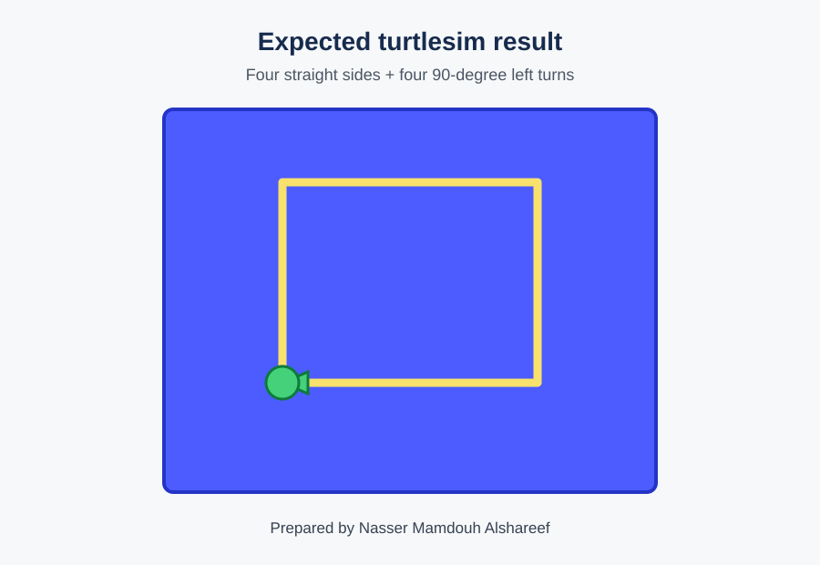
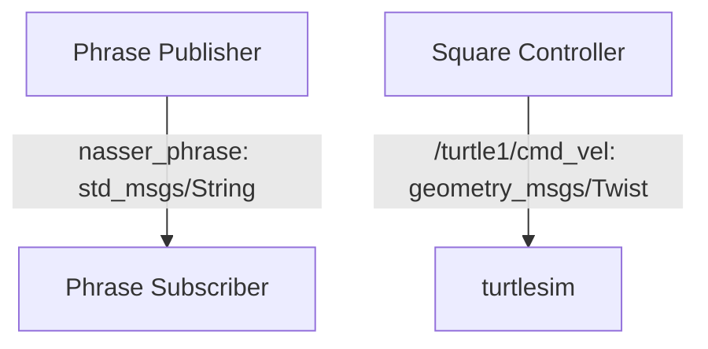

# ROS 2 Publisher, Subscriber, and Turtle Square

**Prepared by / إعداد الطالب:** **ناصر ممدوح الشريف**  
**English name:** **Nasser Mamdouh Alshareef**

This ROS 2 Python project completes both tasks shown in the assignment:

1. A **publisher and subscriber** exchange a custom phrase that is different
   from `Hello World`.
2. A **turtlesim controller** moves the turtle along a square path using four
   straight sides and four 90-degree left turns.

## Assignment coverage

| Required item | Project implementation |
| --- | --- |
| Publisher sends a non-`Hello World` phrase | `phrase_publisher.py` publishes a custom phrase once per second |
| Subscriber receives the phrase | `phrase_subscriber.py` listens to the same `nasser_phrase` topic |
| Turtle follows a square | `square_turtle.py` publishes timed velocity commands to `/turtle1/cmd_vel` |
| Four equal sides and four turns | `SquareController` alternates straight motion and 90-degree left turns four times |
| GitHub-ready documentation | This README includes installation, building, running, testing, and file explanations |

## Expected square result



The image above is an expected-result diagram. When the ROS node runs in
turtlesim, the turtle's pen draws the same four-sided path.

## How the nodes communicate



## Project structure

```text
.
├── nasser_ros2_tasks/
│   ├── __init__.py
│   ├── phrase_content.py
│   ├── phrase_publisher.py
│   ├── phrase_subscriber.py
│   ├── square_controller.py
│   └── square_turtle.py
├── launch/
│   ├── pubsub_demo.launch.py
│   └── square_demo.launch.py
├── tests/
│   ├── test_phrase_content.py
│   └── test_square_controller.py
├── docs/
│   └── expected_square.svg
├── examples/
│   └── expected_pubsub_output.txt
├── resource/nasser_ros2_tasks
├── package.xml
├── setup.py
├── setup.cfg
├── requirements.txt
├── AUTHOR.txt
├── LICENSE
├── .gitignore
└── README.md
```

## Requirements

- Ubuntu with ROS 2 desktop installed (Jazzy on Ubuntu 24.04 or Humble on
  Ubuntu 22.04)
- `turtlesim`, `colcon`, and `rosdep`
- Python 3 supplied with the selected ROS 2 distribution

The ROS dependencies are declared in `package.xml`. No extra pip runtime
packages are required; `requirements.txt` records this intentionally.

## Add the package to a ROS 2 workspace

After extracting the ZIP file, open a terminal and run:

```bash
mkdir -p ~/ros2_ws/src
cp -r /path/to/nasser-ros2-turtle-square ~/ros2_ws/src/nasser_ros2_tasks
cd ~/ros2_ws
```

Replace `/path/to/` with the actual location of the extracted project.

Load the installed ROS 2 distribution. Use the command that matches the
computer:

```bash
# ROS 2 Jazzy
source /opt/ros/jazzy/setup.bash

# OR ROS 2 Humble
source /opt/ros/humble/setup.bash
```

Install declared dependencies and build the package:

```bash
cd ~/ros2_ws
rosdep install --from-paths src --ignore-src -r -y
colcon build --packages-select nasser_ros2_tasks
source install/setup.bash
```

The last `source` command must be repeated in every newly opened terminal.

## Task 1: run the publisher and subscriber

The simplest method starts both nodes from one launch file:

```bash
ros2 launch nasser_ros2_tasks pubsub_demo.launch.py
```

The publisher sends this phrase with an increasing message number:

```text
Robotics makes ideas move - Nasser Mamdouh Alshareef
```

Both the sent and received data appear in the terminal once per second. Press
`Ctrl+C` to stop. A formatted example is included in
`examples/expected_pubsub_output.txt`.

### Run the two nodes in separate terminals

Terminal 1:

```bash
cd ~/ros2_ws
source /opt/ros/jazzy/setup.bash
source install/setup.bash
ros2 run nasser_ros2_tasks phrase_publisher
```

Terminal 2:

```bash
cd ~/ros2_ws
source /opt/ros/jazzy/setup.bash
source install/setup.bash
ros2 run nasser_ros2_tasks phrase_subscriber
```

Replace `jazzy` with `humble` when using ROS 2 Humble.

## Task 2: move the turtle in a square

Start turtlesim and the controller together:

```bash
ros2 launch nasser_ros2_tasks square_demo.launch.py
```

The launch file starts turtlesim, waits one second, and then starts the motion
node. The default sequence takes about 16 seconds:

1. Move forward 2 units.
2. Turn left 90 degrees.
3. Repeat the same movement four times.
4. Publish zero velocity and stop.

The turtle remains visible after the square is complete. Close the launch with
`Ctrl+C`.

### Run with different square settings

First start turtlesim:

```bash
ros2 run turtlesim turtlesim_node
```

In a second terminal, run the controller with ROS parameters:

```bash
ros2 run nasser_ros2_tasks square_turtle --ros-args \
  -p side_length:=2.0 \
  -p linear_speed:=1.0 \
  -p angular_speed:=0.7853981633974483
```

Keep the side length within the turtlesim window. The angular speed above is
approximately π/4 radians per second, so each 90-degree turn takes two seconds.

## How the square algorithm works

`SquareController` is a small state machine with three phases:

- `MOVING`: publish positive `linear.x` and zero `angular.z`.
- `TURNING`: publish zero `linear.x` and positive `angular.z`.
- `FINISHED`: publish zeros after four completed sides.

The straight duration is calculated as:

```text
move duration = side length / linear speed
```

The turn duration is calculated as:

```text
turn duration = (π / 2) / angular speed
```

Keeping this calculation in `square_controller.py` makes the motion logic easy
to test without opening turtlesim.

## Tests

The included unit tests verify the custom phrase, state transitions, four-side
completion, zero stop command, small timer steps, reset behavior, and invalid
parameters:

```bash
cd ~/ros2_ws/src/nasser_ros2_tasks
python3 -m unittest discover -s tests -v
```

After building in a ROS 2 environment, package tests can also be run with:

```bash
cd ~/ros2_ws
colcon test --packages-select nasser_ros2_tasks
colcon test-result --verbose
```

## Common problems

### `ros2: command not found`

ROS 2 is not loaded in the current terminal. Run
`source /opt/ros/jazzy/setup.bash` or the matching Humble command.

### `Package 'nasser_ros2_tasks' not found`

Build from `~/ros2_ws`, check that the project is inside `~/ros2_ws/src`, and
then run `source ~/ros2_ws/install/setup.bash`.

### turtlesim opens but does not move

- Confirm that the controller terminal has sourced the workspace.
- Check the topic with `ros2 topic echo /turtle1/cmd_vel`.
- Confirm that both nodes use the same ROS domain and network environment.

### The square is slightly rounded

The task uses timed open-loop velocity control. Small timing differences can
slightly round the corners, but the controller still performs four equal
forward periods and four 90-degree turn periods.

## شرح مختصر بالعربي

المشروع ينفّذ مطلوبين: الأول Publisher يرسل عبارة مخصصة وSubscriber
يستقبلها ويعرضها. الثاني يرسل أوامر السرعة للسلحفاة حتى تتحرك
بأربعة أضلاع متساوية وأربع لفات يسار مقدار كل منها 90 درجة.

أهم أمرين بعد البناء:

```bash
ros2 launch nasser_ros2_tasks pubsub_demo.launch.py
ros2 launch nasser_ros2_tasks square_demo.launch.py
```

## References

- [ROS 2 Python publisher and subscriber tutorial](https://docs.ros.org/en/jazzy/Tutorials/Beginner-Client-Libraries/Writing-A-Simple-Py-Publisher-And-Subscriber.html)
- [ROS 2 turtlesim introduction](https://docs.ros.org/en/jazzy/Tutorials/Beginner-CLI-Tools/Introducing-Turtlesim/Introducing-Turtlesim.html)
- [ROS 2 topic concepts](https://docs.ros.org/en/jazzy/Tutorials/Beginner-CLI-Tools/Understanding-ROS2-Topics/Understanding-ROS2-Topics.html)

